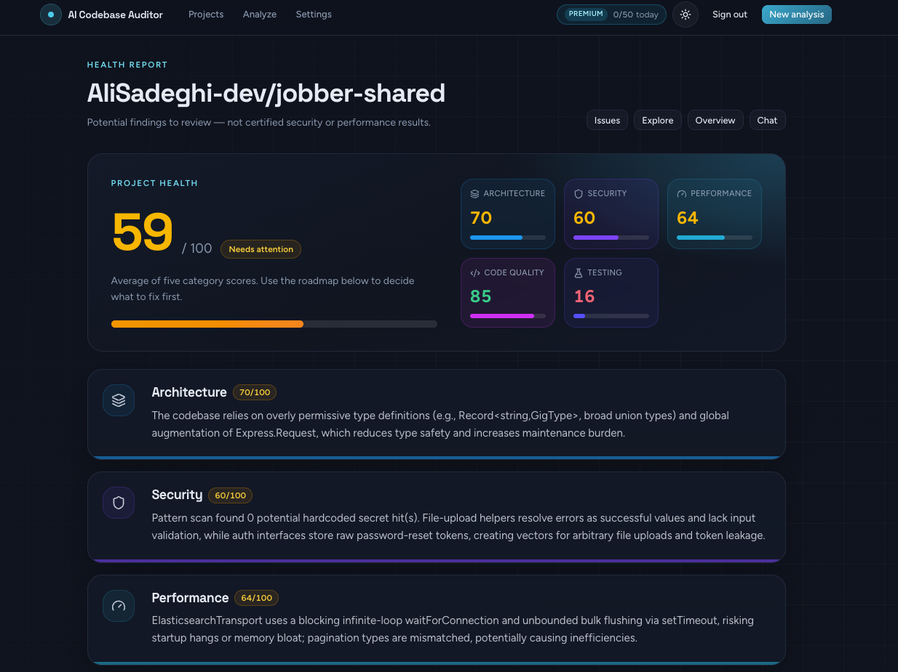
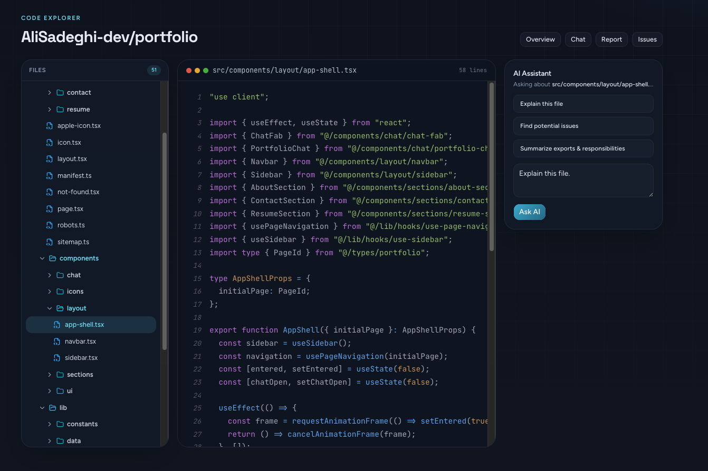

# AI Codebase Auditor

An AI senior developer for your repository.

Connect a GitHub repo or upload a ZIP. The app reads your JavaScript and TypeScript, builds a searchable knowledge of the code, then gives you a health report, a prioritized issue list, and chat answers grounded in real files.

<p align="center">
  
</p>

<p align="center"><em>Health report with category scores and findings to review.</em></p>

## What you get

- **Health report** — architecture, security, performance, code quality, and testing, each scored 0–100
- **Issues & roadmap** — findings grouped by severity and category, ordered by what to fix first
- **Grounded chat** — ask how auth works, where payments live, or what a file does; answers cite files and line ranges
- **Code explorer** — browse the tree, read source, and ask the AI about the open file

<p align="center">
  
</p>

<p align="center"><em>Code explorer — files, source, and a file-level AI assistant.</em></p>

Findings are **potential issues to review**, not certified security or performance results.

## How it works

```
Repository or ZIP
        ↓
  Filter & extract files
        ↓
  Detect framework
        ↓
  Parse JS / TS (Tree-sitter)
        ↓
  Chunk → embed → store in pgvector
        ↓
  Analyze with LLM → health report
        ↓
  Chat, explorer, and issues (RAG)
```

Only `.js`, `.jsx`, `.ts`, and `.tsx` are parsed. Noise such as `node_modules`, build output, binaries, and lockfiles is skipped. Embeddings run locally; chat and reports go through Groq.

## Stack

| Layer | Choice |
| --- | --- |
| App | Next.js 16, React 19, TypeScript, Tailwind CSS, shadcn/ui |
| Auth | Auth.js — Google, GitHub, and email |
| Data | PostgreSQL, Prisma, pgvector |
| AI | Groq + Vercel AI SDK; local MiniLM embeddings |
| Parsing | Tree-sitter (JavaScript / TypeScript) |
| Billing | Stripe (Free and Premium) |

## Getting started

You need **Node.js 20+**, **Yarn**, and a **Postgres** database with the [pgvector](https://github.com/pgvector/pgvector) extension (Neon or Supabase work well).

```bash
yarn install
cp .env.example .env
```

Fill in `.env` (see below). Then enable pgvector, push the schema, and start the app:

```bash
# In your database (Supabase SQL editor, Neon console, or psql)
CREATE EXTENSION IF NOT EXISTS vector;

yarn db:push
yarn dev
```

Open [http://localhost:3000](http://localhost:3000).

For Stripe webhooks in development:

```bash
stripe listen --forward-to localhost:3000/api/billing/webhook
```

Copy the signing secret into `STRIPE_WEBHOOK_SECRET`.

## Environment

Copy `.env.example` and set at least the required keys:

| Variable | Purpose |
| --- | --- |
| `DATABASE_URL` | Postgres connection string (prefer the session pooler + `?sslmode=require`) |
| `AUTH_SECRET` | Auth.js secret (`openssl rand -base64 32`) |
| `AUTH_URL` | App URL (`http://localhost:3000` locally) |
| `GOOGLE_CLIENT_ID` / `GOOGLE_CLIENT_SECRET` | Google sign-in |
| `GITHUB_CLIENT_ID` / `GITHUB_CLIENT_SECRET` | GitHub sign-in and repo access |
| `GROQ_API_KEY` | Chat, reports, and file explanations |
| `STRIPE_SECRET_KEY` | Billing |
| `NEXT_PUBLIC_STRIPE_PUBLISHABLE_KEY` | Checkout |
| `STRIPE_PRICE_PREMIUM` | Recurring Premium price ID |
| `STRIPE_WEBHOOK_SECRET` | Webhook verification |

Embeddings use `@xenova/transformers` locally — no extra API key. Optional Groq model and plan-limit overrides are documented in `.env.example`.

OAuth callback URLs:

```
http://localhost:3000/api/auth/callback/google
http://localhost:3000/api/auth/callback/github
```

GitHub sign-in also grants repository read access. Google or email users can connect GitHub later from Settings, or skip it and upload a ZIP.

## Scripts

| Command | What it does |
| --- | --- |
| `yarn dev` | Next.js development server |
| `yarn build` / `yarn start` | Production build and server |
| `yarn lint` | ESLint |
| `yarn test` | Vitest |
| `yarn test:e2e` | Playwright |
| `yarn db:push` | Push Prisma schema to the database |
| `yarn db:migrate` | Create and apply a migration |
| `yarn db:studio` | Prisma Studio |

## Limits (MVP)

- Max analyzed size: **100 MB** (after ignored files)
- Max files: **1,000**
- Max file size: **500 KB** (larger files are skipped)
- Languages: **JavaScript and TypeScript**

Free plan defaults: 5 analyses per day, 5 projects, 20 chat messages per hour. Premium raises those limits (configurable via env).

## License

Private project — all rights reserved unless a license file is added.
